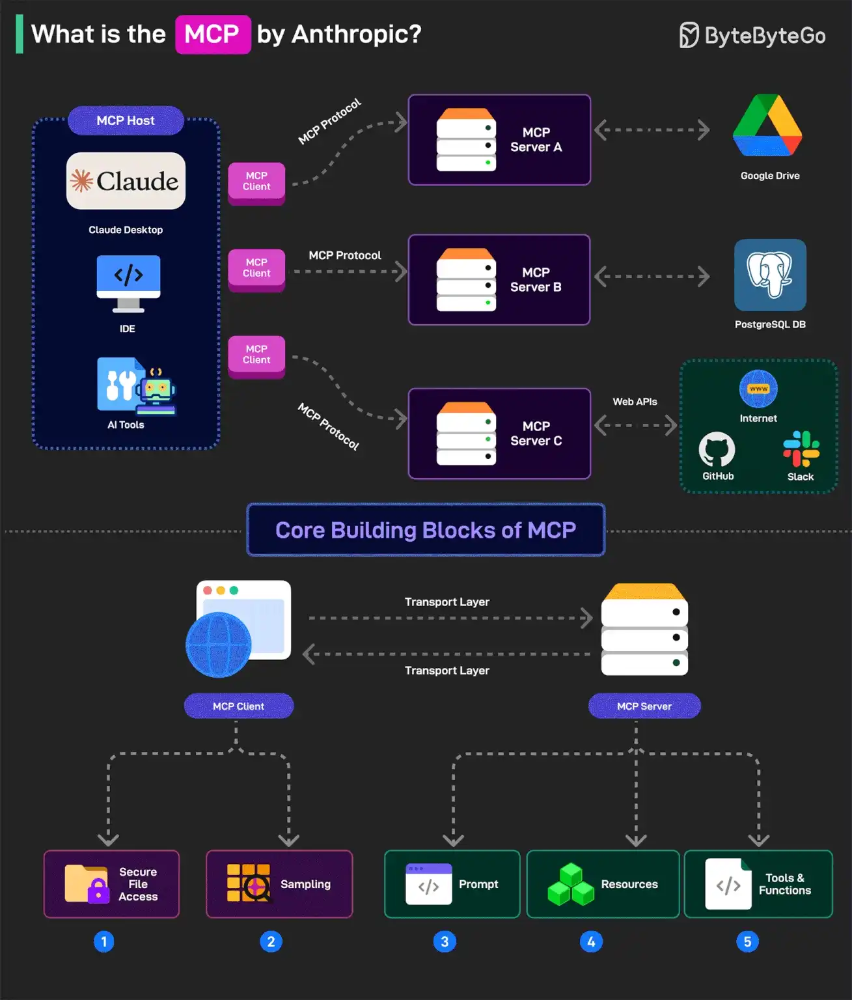

# la3ba_f_ja3ba

## MCP

### MCP servers

- GitMCP

### example 1

## khodra fo9 t3am

**Memory Bank**
- https://github.com/glebkudr/shotgun_code

## Infra

### Paas
   - [Dokku](https://github.com/dokku/dokku)

## Software benchmarking

### PHP
   - https://symfony.com/doc/current/profiler.html

## Front/Back makers

- Lovable
- Bolt
- v0
- Qween
- FireBase

## Vscode extensions

- kilo code
- cline
- Roo code
- Stagewise
  

## Coding agents

## IDEs

- Vscode
- Windsurf
- Cursor
- Trae
- Zed
